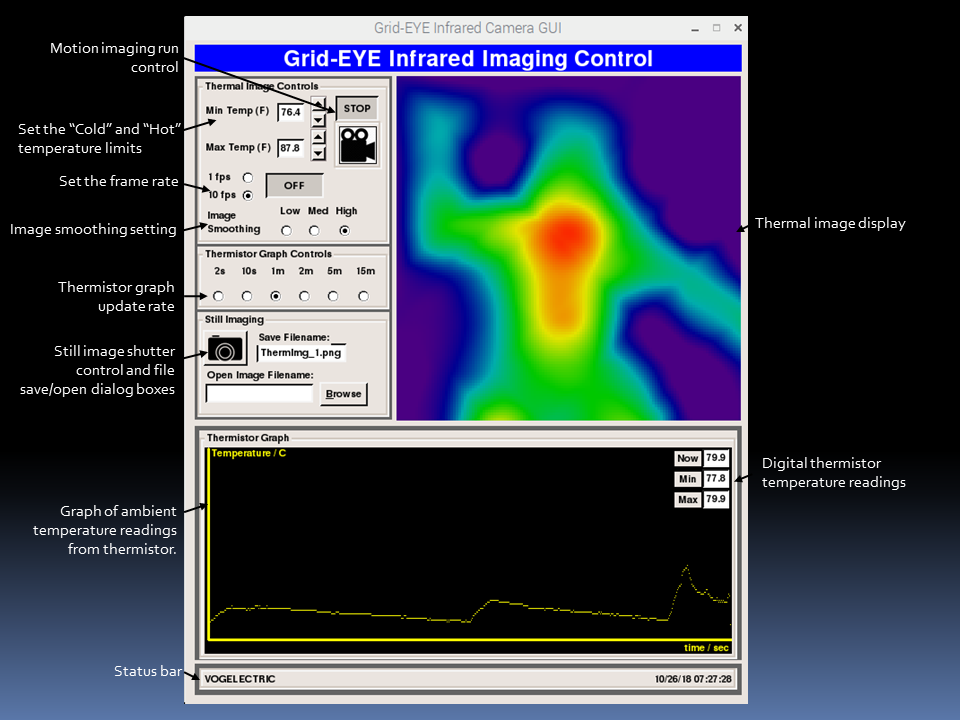

# AMG88-Thermal-Camera GUI Overview
The purpose of this project was to develop a Thermal Camera GUI on the Raspberry Pi capable of capturing infrared motion and still images. The hardware for the GUI is the [Panasonic AMG88 8X8 pixel thermal imager](https://na.industrial.panasonic.com/products/sensors/sensors-automotive-industrial-applications/grid-eye-infrared-array-sensor). The sensor features an 8x8 array of IR thermal sensors which will measure temperatures ranging from 0°C to 80°C (32°F to 176°F) with an accuracy of +- 2.5°C (4.5°F).  Some potential applications include security, lighting control, medical imaging, automatic doors, thermal mapping, people counting, and robotics. It can detect a human from a distance of up to 7 meters (23) feet. The sensor communicates over I2C with a maximum frame rate of 10Hz. The Thermal Imager GUI was developed around the [Adafruit AMG88 breakout board](https://learn.adafruit.com/adafruit-amg8833-8x8-thermal-camera-sensor/overview) and the provided Python library. The Python example code also demonstrates the use of image processing from the SciPy python library which is used to interpolate the 8x8 grid and get smoothed images. Aside from the Adafruit documentation, the following references were used;  
[GRID-EYE SPECIFICATION](DOC/grideye_specification.pdf)  
[GRID-EYE CHARACTERISTICS](DOC/grideye_faq.pdf)     
[GRID-EYE FAQ](DOC/grideye_characteristics.pdf)  
# AMG88-Thermal-Camera GUI Description
Although the Thermal Imaging GUI is to a large extent based on the Adafruit sample code, it is unique in that it extends the Pygame functionality through the use of the [OceampGUI](http://ocemp.sourceforge.net/gui.html) tool kit. The toolkit is a fairly rich set of indicator and control widgets that provide a technical feel to the GUI user experience. In fact the largest effort of the project was to learn and impliment the OceampGUI features. Although development of the toolset appears to be inactive for quite sometime it was fairly mature and easy to user with excellent documentation.    
*GUI Features*

